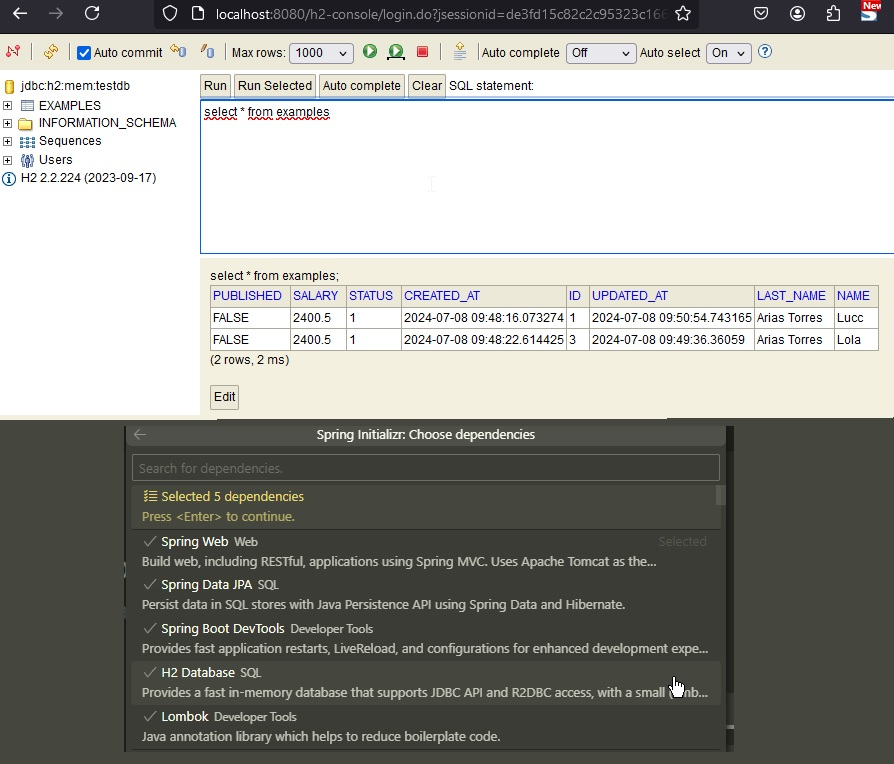

# ☕ 💠 Documentación de API Example v1.0.0 - 2024
## Descripción del proyecto

Este proyecto tiene base Example, para pruebas y uso en general, Crud al 99%.
Try catcht, Junit, Mockito, handleError messageError, H2. application.yml (revisar)

Logs - Logger, configuracion en application.properties


## Recursos
El proyecto esta creado con las siguientes tecnologías, las primeras 5 se obtienen
al momento de crear el proyecto.

| Plugin                | URL                      |
|-----------------------|--------------------------|
| Spring Web            | https://start.spring.io/ |
| Spring Data JPA       | https://start.spring.io/ |
| Spring Boot Dev tools | https://start.spring.io/ |
| Lombok                | https://start.spring.io/ |
| H2 Database           | https://start.spring.io/ |

## Estructura 📁
```sh
├─── Controllers
├─── Services (classes & interfaces)
├─── Repositories
├─── Dtos (ExampleCreateDto, ExampleUpdateDto, ExampleFindNameDto)
├─── Entities
└─── Exceptions
```
## Config vsCode 🔧
User Settings.json  ctrl + shif + p
```sh
    "workbench.editor.customLabels.patterns": {
        "**/Entities/**": "${filename}.${extname} 💎",
        "**/entities/**": "${filename}.${extname} 💎",
        "**/Models/**": "${filename}.${extname} 💎",
        "**/models/**": "${filename}.${extname} 💎",
        "**/Dtos/**": "${filename}.${extname} 🔮",
        "**/dtos/**": "${filename}.${extname} 🔮",
        "**/dto/**": "${filename}.${extname} 🔮",
        "**/Controllers/**": "${filename}.${extname} 💊",
        "**/controllers/**": "${filename}.${extname} 💊",
        "**/Exceptions/**": "${filename}.${extname} 🔋",
        "**/exceptions/**": "${filename}.${extname} 🔋",
        "**/Repositories/**": "${filename}.${extname} 💿",
        "**/Repository/**": "${filename}.${extname} 💿",
        "**/Services/**": "${filename}.${extname} 📀",
        "**/Service/**": "${filename}.${extname} 📀",
        "**/service/**": "${filename}.${extname} 📀",
        "**/test/**": "${filename}.${extname} 🔬",
        "**/main/java/**/**Application.java": "${filename}.${extname} - ☕ "
        // "**/src/**/index.html": "${dirname}/${filename}"
        // 🔮 🔰 💠 🏆 🎫 🔥 💧 🌐 🌍 🍚 🎲 🥌 🌄 🌋 🌅 🕋 💳 📮
    },
```
Activar el Linked Editing(para etiquetas HTML)
```
 Ir a preferencias usuario y busca: Linked Editing y activar.
 Activar: Bracket Pair Colorization: Enabled (color a las { } )
 Activar: Bracket Pairs (Colo linea del bloque del cursor)
 Desactivar: breadcrumbs (Opcional)
 Activar: sticky scroll (queda el bloque el nombre actual)
```
En application.properties
```
server.servlet.context-path=/api (funciono)
#spring.data.rest.basePath=/api (no F)
```

## Accesos

Acceso a la base de datos H2 mediante URL:

```sh
url: http://localhost:8080/h2-console/
user: sa
password:123
```


## Uso en Postman

### GET
```sh
http://localhost:8080/api/example/all

http://localhost:8080/api/example/find/1

http://localhost:8080/api/example/findbyname?nombre=Lucc
```

### POST (crear Example)
```sh
http://localhost:8080/api/example/create
```
Hay que insertar un JSON para esta petición.

``` json
{
    "name":"Lucc",
    "last_name":"Arias",
    "status": 1,
    "salary":1800.50
}
```

### POST (editar Example)
```sh
http://localhost:8080/api/example/update/2
```

Hay que insertar un JSON para esta petición.

``` json
{
    "name":"Lola",
    "last_name":"Arias Torres",
    "status": 1,
    "salary":2400.50
}
```

### DELETE
```sh
http://localhost:8080/api/example/delete/2
```

## Referencias 📚

- * https://github.com/bezkoder/spring-boot-one-to-many (Handle Exception)
- * https://github.com/jaaxteam/resfulapi/
- * https://github.com/jorgemezapaz/AdvancedLevelException

- * 📹
- * YT - Spring Boot Avanzado - Manejo de excepciones nivel Pro
- * YT - Java :How to set base url for rest in spring boot?(5solution)
- * YT - https://www.youtube.com/watch?v=lGrcZsw-hKQ
- * 🗃️
- * https://docs.spring.io/spring-framework/reference/web/webmvc/mvc-controller/ann-methods/jackson.html
- * https://anotherdayanotherbug.wordpress.com/2015/01/07/spring-boot-series-autoconfiguracion-de-jackson/
- * https://code.visualstudio.com/docs/getstarted/userinterface
- * https://html-css-js.com/html/character-codes/
- * https://www.indiabix.com/online-test/java-programming-test/ (test java online questions)
- * https://docs.spring.io/spring-boot/docs/2.1.13.RELEASE/reference/html/boot-features-logging.html
- * https://docs.spring.io/spring-boot/reference/features/logging.html
- * https://stackoverflow.com/questions/39158191/default-logging-file-for-spring-boot-application
- * 
---
